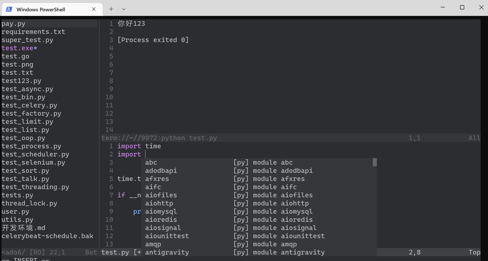

# Win11-neovim0.8.2-config-Python

Windows11 NeoVim0.8.2 Python It's Awesome



## HowTo

```
python3 -m pip install pynvim
python3 -m pip install jedi
pip3 install neovim --upgrade
```

I use [vim-plug](https://github.com/junegunn/vim-plug) to manage my plugins, you can deactive unneeded ones by commenting `~/AppData/Local/nvim/init.vim`.

put init.vim in ur path:~/AppData/Local/nvim

run `nvim` then run `:PlugInstall` 
